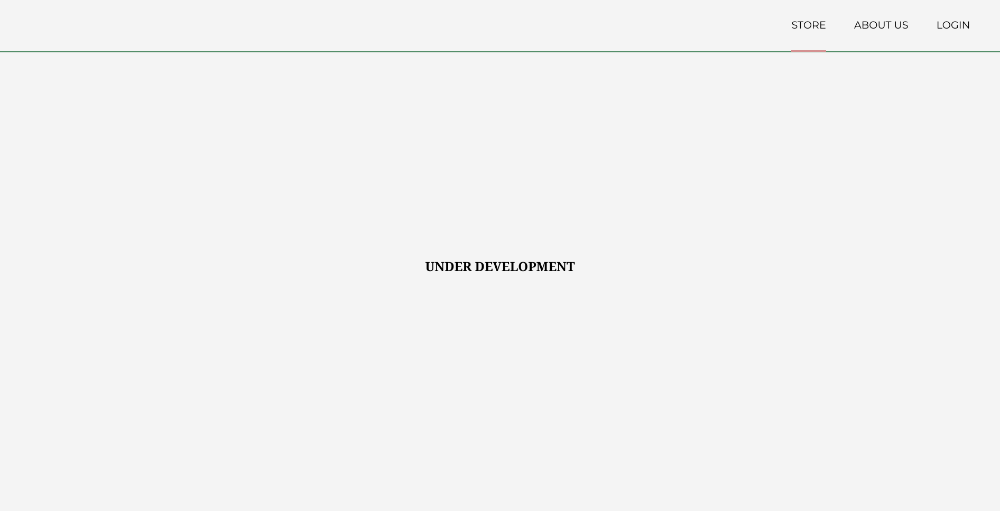
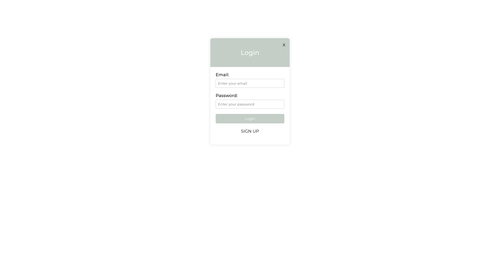
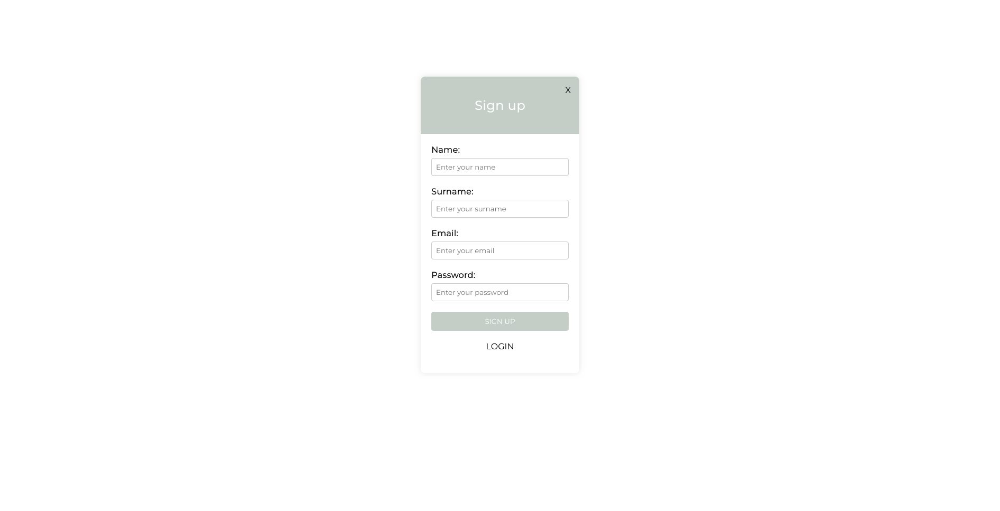
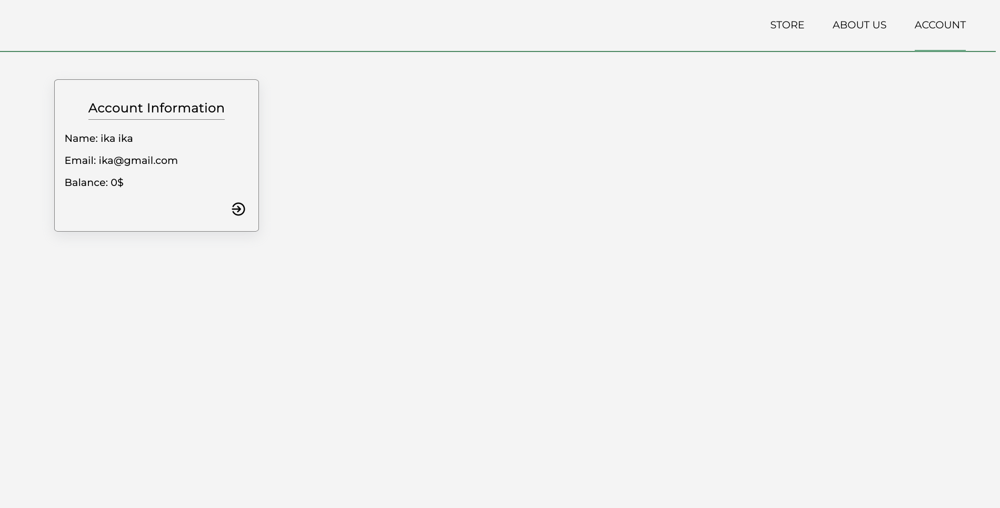

# basic-authentication

A simple **Flask web application** with user authentication.
The project uses **Flask** and **SQLite** to handle user data (emails and passwords) and provide **sign-up, sign-in** functionality.

---
